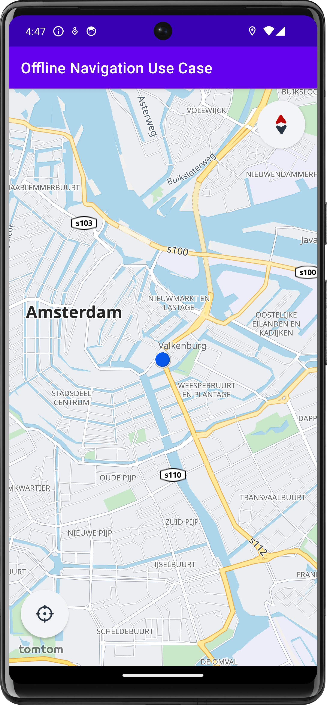
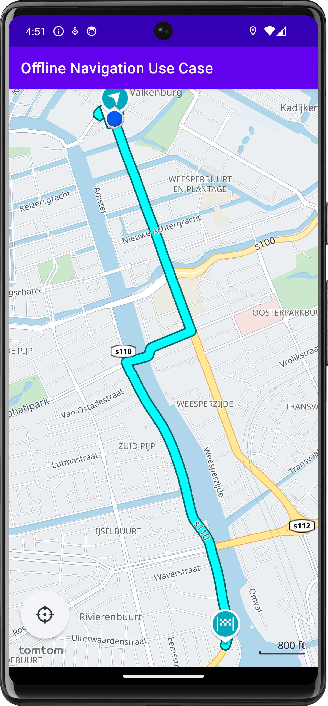

# TomTom Navigation SDK examples

This repository contains a set of individual Android Studio projects showcasing features for TomTom Navigation SDK for
Android.

For more information,
please [read the documentation](https://developer.tomtom.com/navigation/android/introduction/introduction).

💻 Requirements
------------
> **Note**  TomTom Navigation SDK for Android is only available upon
> request. [Contact us](https://developer.tomtom.com/tomtom-sdk-for-android/request-access "Contact us") to get access.

Once you have obtained access, do the following:

* Install the latest Android Studio. This sample code was build using Android Studio Jellyfish | 2023.3.1
* Make sure that the minimum SDK API level is set to at least 26 (Android 8.0 "Oreo") and that the compile SDK API
  level is set to 34.

## Cloning the repository
Clone the repository `https://github.com/tomtom-international/tomtom-navigation-android-examples.git`

🚀 Examples
------------

| Project                                                                                                                                                                                                                                                                                                                                                      |                                                                                                           |                                                                                                                               |                                                                                                                         |
|--------------------------------------------------------------------------------------------------------------------------------------------------------------------------------------------------------------------------------------------------------------------------------------------------------------------------------------------------------------|-----------------------------------------------------------------------------------------------------------|-------------------------------------------------------------------------------------------------------------------------------|-------------------------------------------------------------------------------------------------------------------------|
| <b>tomtom-navigation-core-examples</b>  A collection of examples showcasing online use cases, including a basic driving application that displays a map, shows the user’s location, calculates and displays routes, and enables turn-by-turn navigation using built-in UI components.   **[> Browse](tomtom-navigation-core-examples/)**   | </img>        | </img>            | </img>            |
| <b>tomtom-navigation-offline-examples</b>  A collection of examples showcasing offline use cases, including a basic driving application that operates with a default installed offline map.   **[> Browse](tomtom-navigation-offline-examples/)**                                                                                          | </img> | </img> | </img> |
