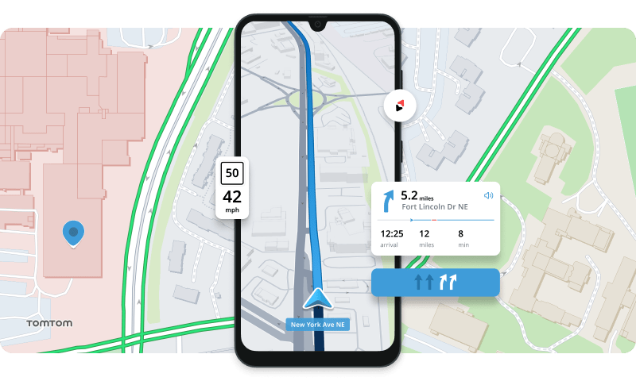

# TomTom Navigation Android SDK Examples

Hello and welcome to this repository with examples showcasing the TomTom Navigation SDK and other APIs [TomTom Navigation SDK for Android](https://developer.tomtom.com/android/navigation/documentation/overview/introduction) using the version 0.3.1014

This sample code is for the Android platform but TomTom also has a version for iOS [here](https://github.com/tomtom-international/migration-tutorial-ios-sdk)

Remember to register in our Developer Portal : https://bit.ly/38nbvLX to get access to your free API and all the documentation and examples for our SDKs You will find this tutorial as well - if you prefer to read.

This code is based on the following video in our Youtube channel: https://youtu.be/raPYxWrqNjA

## Preparation

In order to compile this demo, you need 2 things:
1. Access to the TomTom Maven repository ( Artifactory ) . Please contact TomTom for a password to download the binaries. You will need these to add the credentials as ENV variables. Check the settings.gradle file.

2. An API KEY. Get one for free in the developer portal and make sure that it has the navigation feature activated. If not, contact us.

  

## Installation

Visit our developer portal and follow the [Setup](https://developer.tomtom.com/android/navigation/documentation/overview/project-set-up) guide. Once you have your artifactory credentials, do the following:

### Repository

1. `git clone https://github.com/tomtom-international/navigation-android-examples.git`
2. Create a 'local.properties' files if it doesnt exist and add your API KEY there as

#TomTomApiKey="you key from developer.tomtom.com"

3. Add your credentials from the TomTom Artifactory repo as ENV variables (NavSDKUsername and NavSDKPassword)
4. Run the sample under `app`.

## Getting Help

- **Found a bug? To report** [Open an issue](https://github.com/tomtom-international/navigation-android-examples.git/issues). If possible, include the version of the TomTom Nav SDK and a copy of the logcat.
- **Do you have a request?** [Open an issue](https://github.com/tomtom-international/navigation-android-examples.git/issues/). Let us know what would you like and why. Thanks!

## Contributing

We welcome feedback and happy navigating!
