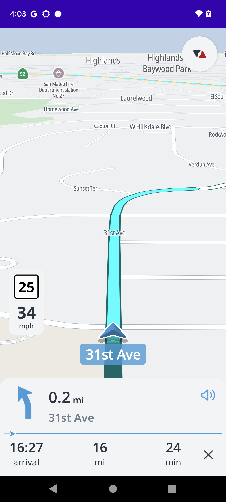

# TomTom Navigation Android SDK Examples

Hello and welcome to this repository with examples showcasing the [TomTom Navigation SDK for Android](https://developer.tomtom.com/android/navigation/documentation/overview/introduction) 

*Note: Navigation SDK for Android is only available upon request. [Contact us](https://developer.tomtom.com/tomtom-sdk-for-android/request-access "Contact us") to get access.*

<div align="center">
  
</div>

## Setup
Once you have obtained access, do the following:

### Android setup
Make sure that the minimum SDK API level is set to at least 21 (Android 5.0 "Lollipop") and that the compile SDK API level is set to 31.

### Cloning the repository
Clone the repository `https://github.com/tomtom-international/navigation-android-examples.git`

### Add gradle.properties file
Add the entries below to the global `~/.gradle/gradle.properties` file at `$HOME/.gradle/gradle.properties`.

```bash

# required for accessing to artifactory
artifactoryUsername=###
artifactoryPassword=###

# required in order to use TomTom's APIs
tomtomApiKey = YOUR_API_KEY
```

