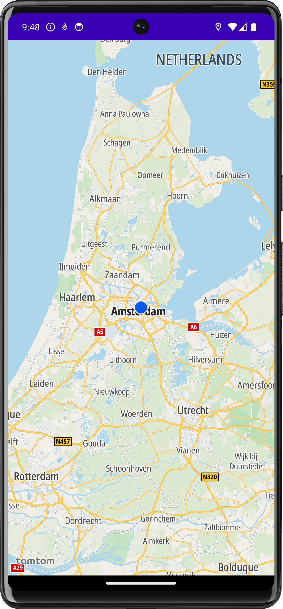
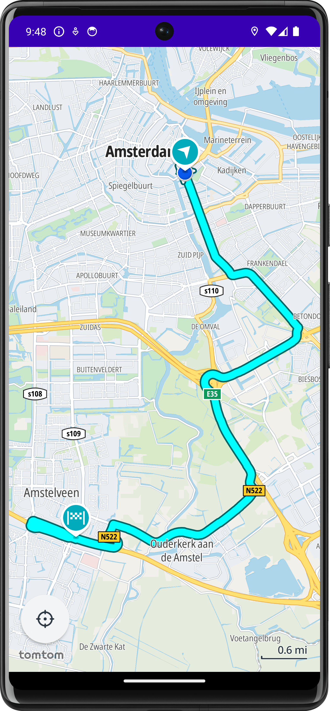
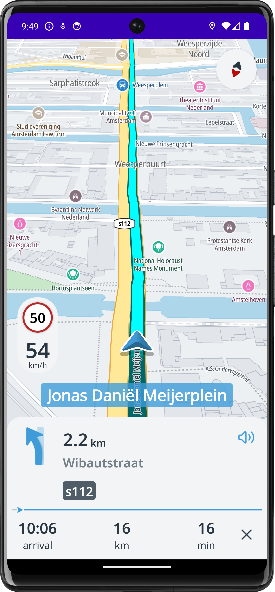

# Online navigation app using TomTom SDK

This project is a sample app to show how to run online modules using the TomTom Navigation SDK on Android.

- [TomTom Navigation SDK for Android](https://developer.tomtom.com/android/navigation/documentation/overview/introduction).

> **Note:** It's not a complete app that includes all TomTom Navigation SDK functionalities and implementations.

<div align="center">
  
</div> <br>

## Features

- Show the map and the user location
- Long press on the map to start a navigation
- Tap on the search result to start a navigation
- Navigation view
    - Next instruction view
    - Route line progress view
    - Estimated time of arrival (ETA) view
    - Lane guidance view
    - Combined instruction view
    - Route updated view

## Setup

> **Note** TomTom Navigation SDK for Android is only available upon
> request. [Contact us](https://developer.tomtom.com/tomtom-sdk-for-android/request-access "Contact us") to get access.

Once you have obtained access, do the following:

### Add gradle.properties file

Add your TomTom API key below to the global `gradle.properties` file at `$HOME/.gradle/gradle.properties`.

```bash
# required in order to use TomTom's APIs
tomtomApiKey=###
```

### Running the app

- The first time you launch the app you will be prompted to allow the app access to your location. Choose "While using
  the app".
- The globe and map will swiftly appear, with your current location marker appearing after a brief moment. Center the
  map on your location by tapping the current location button.
- To calculate a route, perform a long click on the map.
- Initiate navigation by clicking on the calculated route.

## Preview

You can see the downloaded map when the downloading process finished as below.

| Map                                                         | Route Preview                                                                | Navigation                                                             |
|-------------------------------------------------------------|------------------------------------------------------------------------------|------------------------------------------------------------------------|
|  |  |  |

## Subdirectories
- [Link to Use Case README](usecase/README.md)
