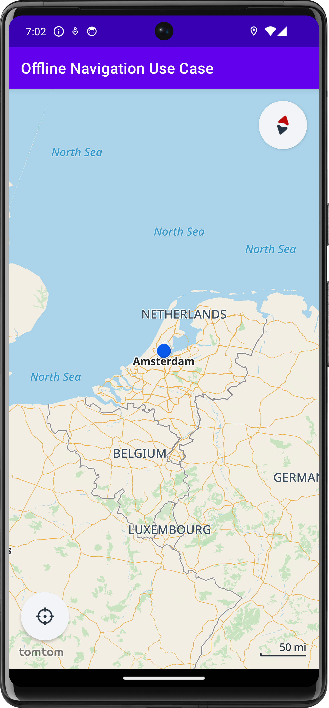
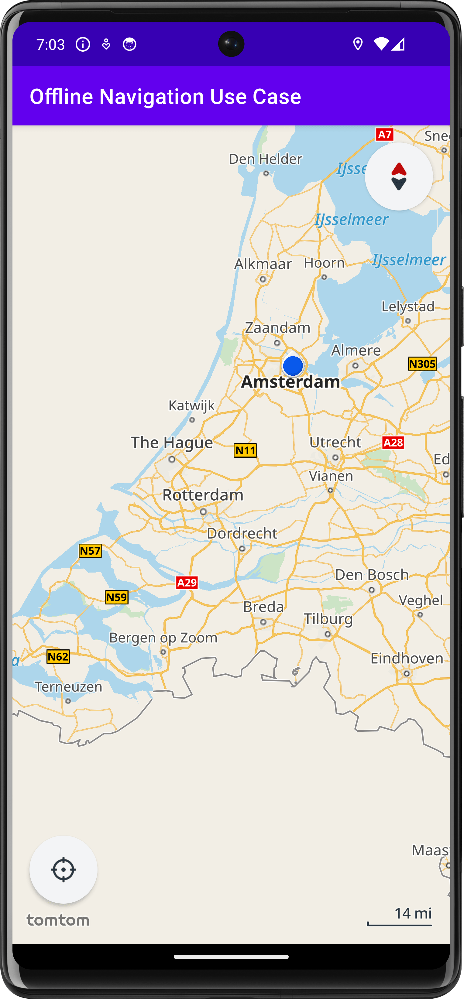

## Offline Navigation Use Case for Android ##

This project is a sample app to show how to run offline modules using the TomTom Navigation SDK on Android.

- [Offline functionality for the TomTom Navigation SDK for Android](https://developer.tomtom.com/navigation/android/guides/offline/quickstart)

> **Note:** It's not a complete app that includes all TomTom Navigation SDK functionalities and implementations.

<div align="center">
  
</div> <br>

This is a reference implementation of the Android [Offline Navigation Use Case Tutorial](https://developer.tomtom.com/navigation/android/build-a-navigation-app/building-an-offline-navigation-app) for the TomTom Navigation SDK.

It does not include integration of the TPEG traffic module described in the tutorial.

An empty NDS map is included. Map data around the device location will be downloaded and installed. Please be patient,
as this may take several minutes to complete, depending on the internet connection speed of the device.
For more information on offline map updates see the [guide](https://developer.tomtom.com/navigation/android/guides/offline/quickstart).

## Features

- Automatically download offline map data around the user's location
- Long press on the map to plan a route
- Tap on the route for a guidance demo with the following features
    - Next instruction view
    - Route line progress view
    - Estimated time of arrival (ETA) view
    - Lane guidance view
    - Combined instruction view
    - Route updated view

## Setup

Because the repository for TomTom Navigation SDK is private, you will need
to [contact us](https://developer.tomtom.com/tomtom-sdk-for-android/request-access) to get access. Once you have
obtained access,

- Go to [repositories.tomtom.com](https://repositories.tomtom.com/) and log in with your account.
- Expand the user menu in the top-right corner, and select "Edit profile" → "Generate an Identity Token".
- Copy your token and paste it into the global gradle.properties file, as described in the next step.

### Add a gradle.properties file

Add the entries below to the global `$HOME/.gradle/gradle.properties` file.

```bash
# Required to access Artifactory
repositoriesTomtomComUsername=###
repositoriesTomtomComPassword=###

# Required to use TomTom APIs
tomtomApiKey=###
```

### Running the app

- The first time you launch the app you will be prompted to allow the app access to your location. Choose "While using
  the app".
- Initially, the globe will be blank as the included NDS map is empty. The app will need to be connected to
  the internet to download map data for offline use. Afterwards, an internet connection is no longer required.
- After a few seconds, the current location marker will appear. Tap the current location button to center on your
  location. The map data for the regions around the location will be downloaded. This can take anywhere from several
  tens of seconds to several minutes, depending on your internet connection speed. After that time panning or zooming
  the map will trigger rendering with the downloaded map data.

## Debugging

The app is configured to download the map regions around the device location. After running the project, the map
downloading process will start automatically. It will take time to download the map. You could follow the progress in
the `Network Inspector` in the `App Inspection` tool within Android Studio.

## Preview

You can see the downloaded map when the downloading and installation process has finished, as shown in the following
example.

| Zoomed Out                                                             | Region Downloaded                                                                          |
|------------------------------------------------------------------------|--------------------------------------------------------------------------------------------|
|  |  |


## Updating along the route

For updates along the planned route, the `AutomaticNdsStoreUpdaterConfiguration` can be edited as follows.

```
automaticUpdates = AutomaticNdsStoreUpdaterConfiguration(
    relevantRegions = RelevantRegions(
        radius = AUTOMATIC_UPDATES_RELEVANT_REGIONS_RADIUS,
        updateInterval = AUTOMATIC_UPDATES_RELEVANT_REGIONS_UPDATE_INTERVAL,
    ),
    regionsAlongRoute = RegionsAlongRoute(
        radius = AUTOMATIC_UPDATES_RELEVANT_REGIONS_RADIUS,
    ),
),
```

Configured as such, map regions close to the route will also be downloaded automatically as soon as navigation is
started.

## Subdirectories
- [Link to Use Case README](usecase/README.md)
